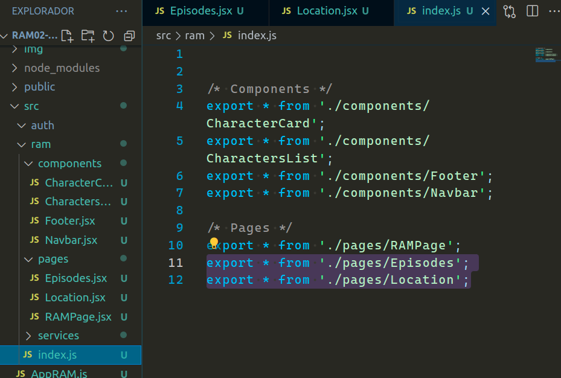
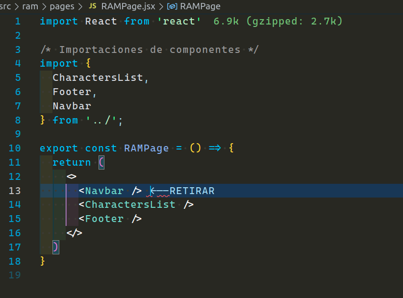

<p align='left'>
  
</P>

<a id="top"></a>

## `Bloques temáticos:`

- [**Instalación**](#item1)
- [**Creando nuestras primeras páginas**](#item2)
- [**React-router-dom**](#item3)
- [**NavLink & Link**](#item4)
- [**Homework**](#item5)

---

---

# `Instalación`

<a id="item1"></a>

Para comenzar a trabajar lo que voy a precisar es hacer la instalación de `react-router-dom`, entonces, arranquemos desde aquí.

Voy a ir a mi terminal de visual studio code y agregaré el siguiente comando para instalar esta dependencia.

```
npm install react-router-dom
```

Este comando lo que hará es instalar la última versión de `react-router`. En este caso, si voy a mi `package.json`, la versión sería la siguiente:


Para instalar esta misma versión puede ingresar el siguiente código:

```
npm install react-router-dom@6.8.1
```

Nosotros iremos haciendo las instalaciones de las últimas versiones en la trayectoria del curso, pero puede que alguien haga este tutorial más adelante y esto es algo que debe tener en cuenta.

---

---

# `Creando nuestras primeras páginas`

<a id="item2"></a>

Ya contando con la instalación de `react-router-dom`, ahora podemos avanzar creando algunas de nuestras páginas que necesitaran rutas y ser manejadas de una manera particular para lograr que sea SPA. Ya veremos como lo haremos.

Dentro del directorio `ram` que sería nuestra aplicación, ya habíamos creado un directorio `pages` que contenía nuestra `RAMPage.jsx`, aquí es donde crearemos las páginas `Episodes.jsx` y `Location.jsx`.


Por el momento dejaremos cada una de nuestras páginas con un `div` que contiene un título. Creo que ya saben mi paso a seguir acorde a mi forma de trabajar en el proyecto. Voy a añadir estas páginas a mi archivo de barril.



---

---

# `React-router-dom`

<a id="item3"></a>

Ya tenemos nuestras páginas, pero estas páginas no las vamos a inyectar como un componente, a estas debemos crear unas rutas para luego ver su contenido a través de `"URLs"`. Para hacer esto necesitaremos el enrutador que nos provee react y así combinarlas con nuestros componentes.

Voy a crear un nuevo directorio al mismo nivel que `auth` y `ram` llamado `router`. Aquí adentro crearé un nuevo archivo llamado `AppRouter.jsx`. Podría dejarlo con extensión `.js`, pero la verdad es que voy a utilizar jsx, así que preferí llamarlo así.


Ahora voy a proceder a modificar mi archivo `AppRAM.js` inyectado en el archivo raíz. Donde inyecto `RAMPage.jsx` ahora voy a inyectar este nuevo componente que contendrá todas mis rutas en un futuro.


Aquí no tiene mucho sentido armar un archivo de barril ya que no voy a importar más de un enrutador en este proyecto, por ende, lo dejaré así como está.

**Estructura de React-router-dom**

Voy a precisar BrowserRouter, Route, Routes de `react-router-dom`, estos serán quienes armen mi estructura para poder navegar entre rutas.

- BrowserRouter: Conecta nuestra aplicación a la URL del navegador, es decir mantiene la interfaz de usuario en sincronía con la URL del navegador mediante la API History de HTML5

- Routes: Genera un árbol de rutas y a partir de este nos permite reemplazar la vista con el componente que coincide con la URL de nuestra barra de navegación y nos va a renderizar solamente dicho componente.

- Route: Representa una ruta en el árbol, necesita al menos las siguientes propiedades path y element, para representar una ruta.

Con esta información comenzaré a trabajar en nuestro `AppRouter.jsx`. Importo los tres desde `'react-router-dom'` y renombro a BrowserRouter a Router, simplemente para que sea más sencillo y corto. Pueden dejarlo como está si quieren.


Va tomando algo de color, y como pueden ver, el router envolverá todas mis rutas, pero también podría envolver contenido que yo quiero que se muestren en todas estas rutas, como lo podría ser un navbar o footer. Veamos un ejemplo de eso.


Aquí lo que estoy logrando es que el navbar sea renderizado en todas en el componente AppRouter, y luego por otro lados renderizaré la ruta según mi URL.

Agreguemos algunas rutas y veamos que sucede.


Resultado:


Ya esta funcionando, sin embargo, podemos ver que navbar aparece dos veces. Eso es porque se está renderizando la ruta `<RAMPage>` por el path `"/"`, y este también tiene el navbar, así que ese ya no lo necesitaremos y podemos retirarlo.



Ahora si. Si nosotros queremos, ya podríamos navegar entre rutas.

Ve al navegador y haz la prueba, agrega la siguiente URL:

```
http://localhost:3000/episodios
```

Deberías ser capaz de ver lo siguiente:


Lo mismo pasaría con `http://localhost:3000/ubicacion`.

---

---

# `NavLink & Link`

<a id="item4"></a>

Como vimos anteriormente podíamos escribir un `URL` y navegar a algunas de tus rutas, esto no es muy perfomante. La idea es que podamos combinar nuestros componentes con estas rutas, es decir, que nosotros al hacer un clic en un componente, nos lleve hacia una ruta específica, como por ejemplo los items de nuestro navbar.

Primero vamos a conocer dos métodos que nos trae `react-router-dom`. Estos son Link y NavLink.

- Link: El componente link en React Router funciona a partir de su propiedad `to`. En esta propiedad, asignamos como valor el enlace a la página que queremos llevar. Por debajo de link hay un elemento a. Sin embargo, React browser Router lo envuelve de una manera en la que no se fuerce la petición al servidor. Por ello, el componente link nos permite mantener la navegación a nivel del browser o navegador.

- NavLink: La diferencia principal es que el navLink, como su nombre indica, se usa principalmente para barras de navegación. Esto se debe a que nos va a dar una clase llamada «active» cuando el elemento haga match con el link en React. Es decir, podemos estilizar cómo se ve el elemento cuando esté seleccionado.

Sabiendo esto, podríamos ya pensar que link podría encajar muy bien con el componente de nuestro logo, por ejemplo o bien con otros componentes fuera del navbar que quieran llevarme a una determinada ruta, como lo podría ser una página de contacto, que al hacer clic en "contactar", te dirija a esta página y ruta específica. Hagamos nuestro ejemplo con el logo e links de navegación.


Así es como se ve nuestro código. Pueden ver que el logo contiene el link que me va a dirigir a "inicio", lo mismo que hace el enlace "personajes", pero con una salvedad, que al ser un NavLink, nosotros podremos utilizar esa clase llamada active para dar unos estilos extras que ya veremos más adelante junto a boostrap.

Resultado:


Por ahora no se ve muy bonita nuestra app, pero al menos ya funciona. Con Leandro lo que buscamos es tratar de ir a un ritmo que no se frustren e ir conociendo las tecnologías lo más desglozado posible y que las entiendan para luego avanzar.

---

---

# `Homework`

<a id="item5"></a>

Para hacer la tarea, primero voy a mostrar algo que está pasando con la navegación de nuestra rutas.
Podemos ver que funciona correctamente cuando se hace clic en un componente, pero que pasa si alguien recibe un link de nuestra app, pero este link no es correcto ya que no está en nuestro enrutador, por ejemplo:

```
http://localhost:3000/perritofeliz
```

Veamos eso:


Podemos ver que nuestro enrutador no hace match con ninguna de nuestras rutas, por ende, nosotros podríamos crear una nueva página para manejar estos casos, y en caso de que nos llegue una URL que no haga match, mostrar un error, por ejemplo un 404 not found.

1 - Crear una nueva página y nombrarla `NotFound.jsx` dentro de nuestro directorio `pages`. El contenido de este componente debe dar información al usuario que la página no ha sido encontrada. Ej: Error 404, página no encontrada.

2 - Añadir la página al archivo de barril.

3 - Crear una nueva ruta, el path será `path="/*"` y el elemento debe ser nuestra página recién creada. Lo que indicamos con /\* es que si una página no hace match con ninguna de nuestras rutas, va a hacer match con esta.

4 - Crear en el directorio `auth` el directorio `pages` y añadir dentro dos páginas, una para login y otra para registro.

5 - crear dentro de `auth` el archivo de barril y exportar estas páginas.

6 - crear rutas para login y registros, los path son a elección.

7 - En nuestro `Navbar`, hay un div que contiene el texto "ingresar", en este vamos a implementar un `Link` similar al del logo, solo que este va a dirigir a mi ruta del componente `Login`, o sea, al path que optaron para el mismo.

Nos vemos con la solución la semana que viene.
