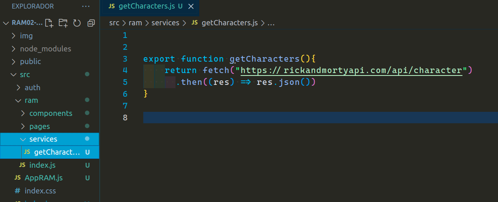
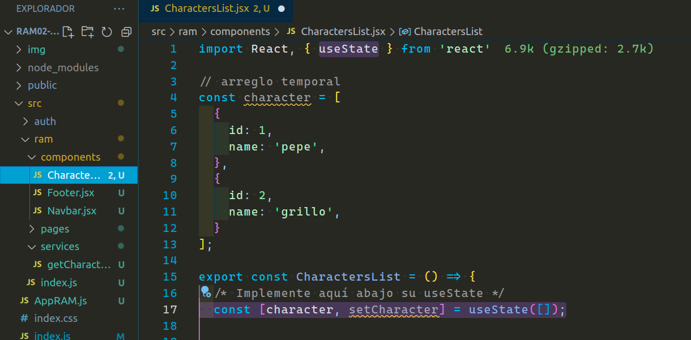
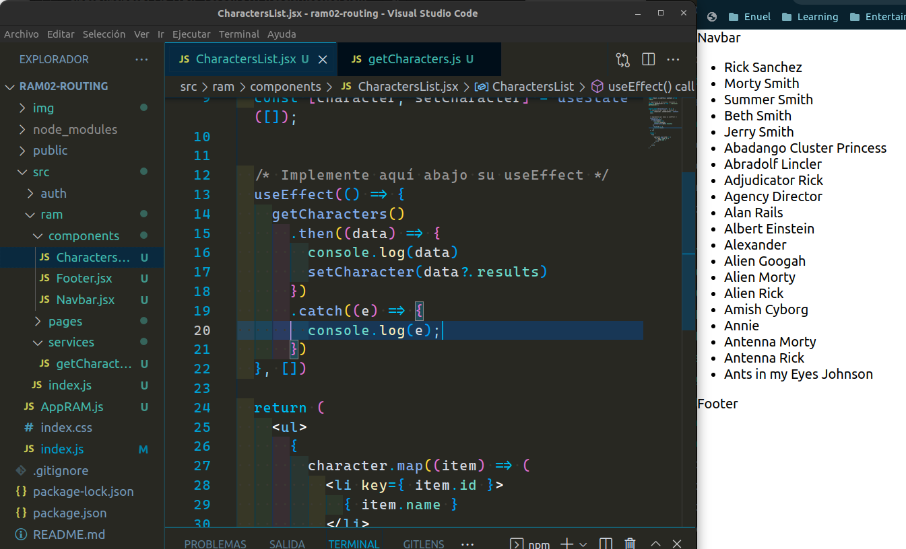
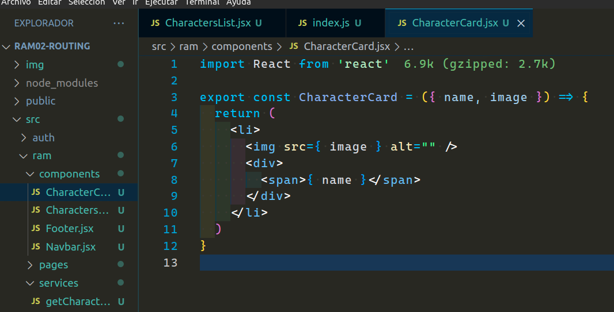
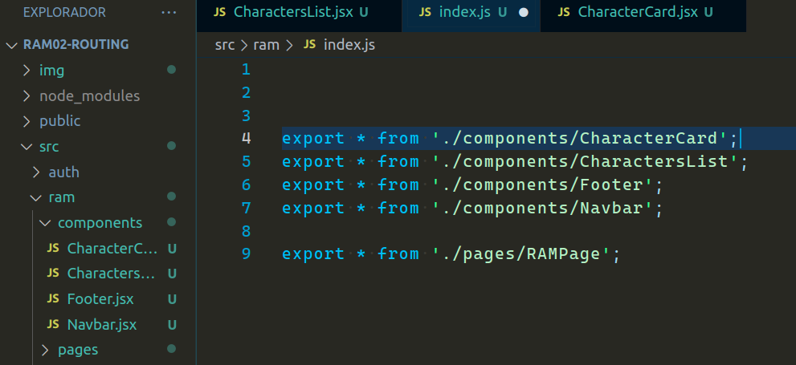
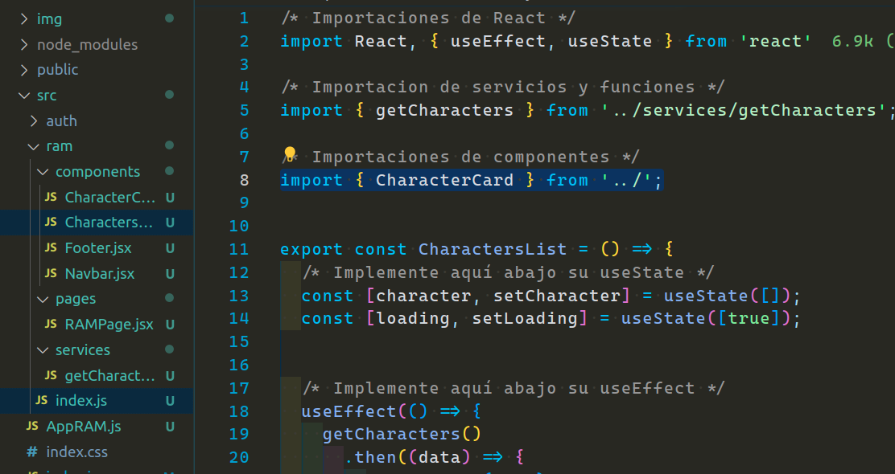
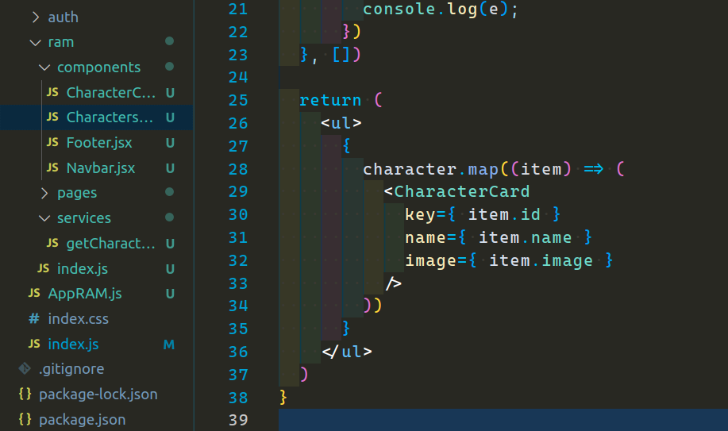
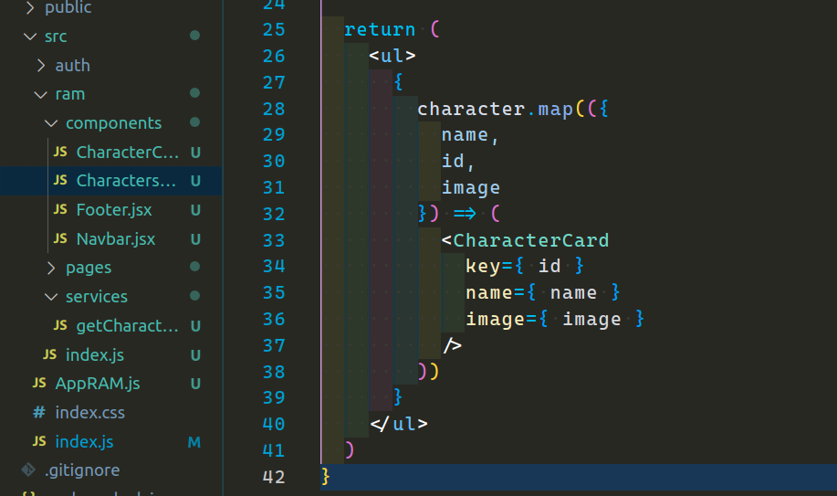
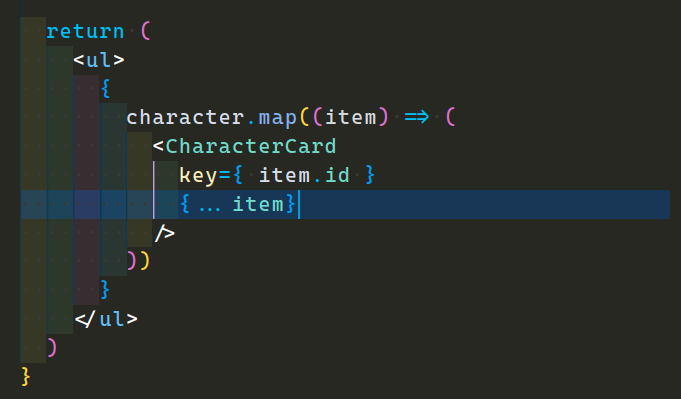
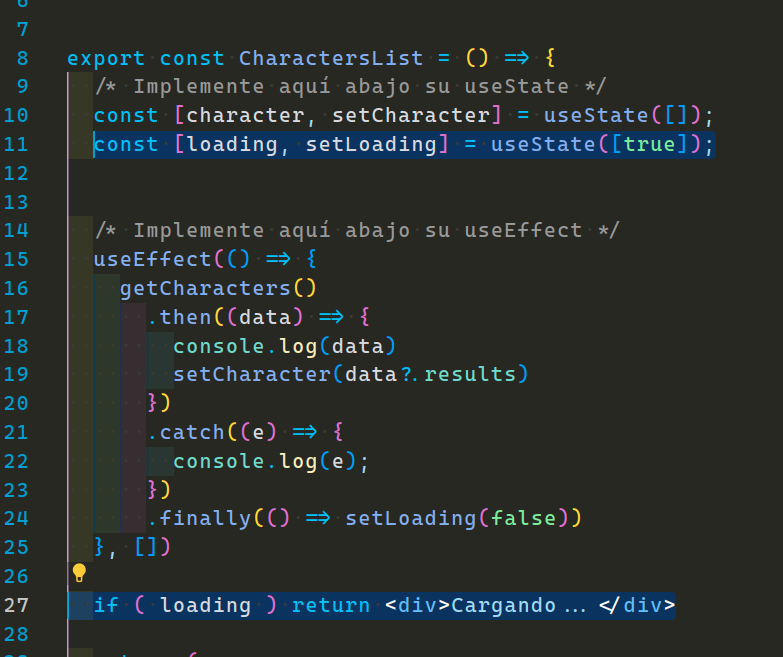

  

## `Bloques temáticos:`

- [**Función fetch**](#item1)
- [**hooks: useState & useEffect**](#item2)
- [**Componetización: CharacterCard.jsx**](#item3)
- [**Archivo de barril**](#item4)
- [**Props de componente**](#item5)
- [**desafío extra: loading**](#item6)

---

---

# `Solución homework`

---

Bueno, comencemos con nuestro homework.

Lo primero que nos pedía era crear un nuevo directorio `services` dentro de nuestra app, en este caso el directorio `ram`. Dentro de este voy a implementar nuestra función que se encargará de hacer el llamado a la Api. Yo lo voy a llamar `getCharacters`.

He creado y exportado una función que retorna una promesa de nuestra Api, con un `.then()` le aplico a esa promesa un `.json()` para obtener un body de esa respuesta. Con esto el primer paso ya está terminado.

---

---

## `hooks: useState & useEffect`

El segundo paso era crear nuestros hooks. Comencemos por el useState que se encargará de manejar nuestros estado, el cual será un array con toda la información que me llegará de mi Api.

Ya podemos borrar el arreglo temporal. Asegurense de importar `useState()` de React.

Ahora proseguimos con nuestro useEffect. Recuerden que este se encargará de hacer nuestro primer renderizado, aquí es donde vamos a pasarle nuestra función `getCharacters`, la cual tenía una promesa. Asegurénse de importar la función.  
El `.then()` recibía una función, el cual la pasabamos por parámetro la data que nos iba a llegar.

Yo lo primero que hice fue hacer un console.log(data), para asegurarme que funcione y además de ver cómo me está llegando la data y como debería manejarla. Ya comprobando que funciona, esta información se la pase la función de mi useState. Agregue un `.catch()`, que por el momento, en caso de haber un error retornaré un console.log() del mismo.

Ya con esto, nuestra App debería estar funcionando, de igual manera, aun queda el tercer punto que va a ser componetizar nuestro `<li>` dentro del map.

[**subir**](#top)

---

---

## `Componetización: CharacterCard.jsx`

En mi carpeta components creo este nuevo componente llamado `CharacterCard.jsx` y le paso el siguiente código:

Es un simple componente que retornará un `<li>`, dentro del mismo tengo una etiqueta `img`y una div con un `span` que contiene el nombre del personaje. Tanto img como el name me van a llegar por props, en este caso ya hice la desestructuración.

[**subir**](#top)

---

---

## `Archivo de barril`

También me pedía que exporte todo desde mi archivo de barril:

A la hora de importar este nuevo componente, solo hay que tener cuidado, ya que tanto el componente `CharacterList` y `CharacterCard` estan en el mismo nivel, por ende, el path de nuestra impotación debe subir un nivel más, simplemente con agregar un punto es suficiente.
Ej: `"../"` en vez de `"./"`.

Así quedan nuestras importaciones hasta el momento:

[**subir**](#top)

---

---

## `Props de componente`

Ahora voy a ir a mi componente `CharactersList.jsx` y voy a inyectar este componente `CharacterCard` en lugar del `li`.

Debo pasarle las props que me pide mi componente `CharacterCard`, esto eran el name, el id e image. El id lo utilizaré para pasarle la llave de identificación que pide ReactJs, y así quitar ese warning de consola.

También podríamos hacer una desestructuración.

Ahora si, me gusto mucho más. Más prolijo y considerable para la vista.

¿Qué pasaría si mi Api maneja mucha información y tengo que hacer un listado mucho más grande de props que debería pasarle? ¿Existe alguna forma un tanto más amigable?
La respuesta es sí, existe una forma y es la siguiente:

Bueno, este código no es difícil de entender. En primer lugar `item` ya sabemos que es el elemento de cada iteración. Lo que debemos tener en cuenta es que por cada iteración a mi me va a llegar un objeto, por ende, en las propiedades de mi componente podría pasarle entre llaves el operador spread para propagar toda esta data de dicho elemento, de esta forma voy a pasar absolutamente toda la información del objeto que me está llegando a mi componente `CharacterCard`, luego en este componente podría desestructurar y utilizar lo que a mi me interese mostrar en este mismo.

[**subir**](#top)

---

---

## `desafío extra: loading`

Ya con esto hemos terminado. Había un plus del loading, que ese lo hacemos rápido. Creamos un hook más el cual lo iniciaremos con un booleano en true. Agregamos a nuestro useEffect el `.finally()`, luego de nuestro `catch()`, con una función que va a recibir mi función `setLoading()` para setear el valor en false.

Abajo lo que quedaría agregar es una condición de que si loading está en true vamos a mostrar un div con un texto que diga "Cargando...", por ejemplo. Esto ya lo mejoraremos con un spinner a futuro.

Listo, ahora si hemos terminado nuestra primera parte de la aplicación.

Los invito a intentar completar el siguiente desafío en el `"README.md"`.

[**subir al índice**](#top)
